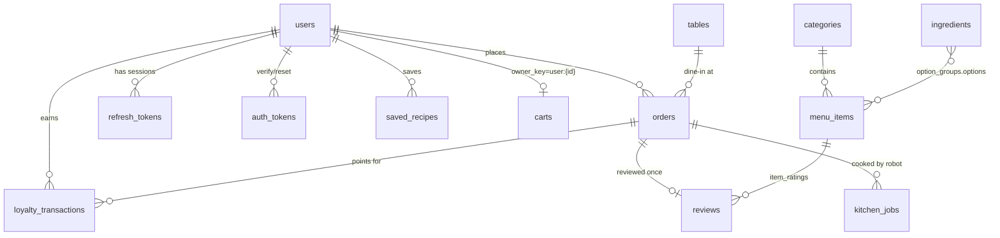

# RoboKitchen — Database Reference (MongoDB)

Database name: `robokitchen` (set by `MONGODB_DB_NAME`). **16 collections.** All indexes are created
automatically on startup from the `INDEXES` dict in `app/core/database.py`, so you never need to create
them by hand — this document lists them for reference and for DBAs.

## Conventions used in every collection

| Convention | Detail |
|---|---|
| Primary keys | `_id` is a **string** with a readable prefix + UUID hex, e.g. `usr_5b05…`, `ord_ec24…`. Not ObjectId. The API exposes it as `id`. |
| Money | **Integer cents** everywhere (`price_cents`, `total_cents`). `1095` = $10.95. No floats for money. |
| Timestamps | BSON Date in **UTC** (`created_at`, `updated_at`). API returns ISO-8601 strings. |
| Soft delete | `menu_items`, `ingredients`, `users` use `is_deleted: true` rather than removal, so historic orders stay intact. |
| Snapshots | Orders copy item names, prices and ingredient names at checkout time. Editing the menu later never changes a past receipt. |
| Secrets | Passwords are bcrypt hashes; email/reset tokens and guest order tokens are stored as SHA-256 hashes only. |
| TTL | `refresh_tokens`, `auth_tokens`, `carts` auto-expire via TTL index on `expires_at`. |

## Relationship diagram



## Collection overview

| # | Collection | Purpose | Written by |
|---|---|---|---|
| 1 | `users` | Customers, staff and admins | `/auth/register`, `/admin/users` |
| 2 | `refresh_tokens` | Active login sessions (refresh-token rotation) | login / refresh / logout |
| 3 | `auth_tokens` | One-time email-verification & password-reset tokens | auth flows |
| 4 | `tables` | Restaurant tables + QR codes | `/admin/tables` |
| 5 | `categories` | Menu categories (Bowls, Drinks…) | `/admin/categories` |
| 6 | `ingredients` | Bowl-builder ingredients / add-ons with robot dispenser codes | `/admin/ingredients` |
| 7 | `menu_items` | Dishes, incl. the custom "Build Your Own Bowl" | `/admin/menu-items` |
| 8 | `carts` | One live cart per user or guest session | `/cart/*` |
| 9 | `orders` | Placed orders with pricing & payment snapshot | `/orders/checkout`, staff |
| 10 | `kitchen_jobs` | Robot cooking queue, one job per order | order confirmation, `/kitchen/*` |
| 11 | `reviews` | Post-order ratings | `/reviews` |
| 12 | `saved_recipes` | Favourite custom bowls | `/recipes` |
| 13 | `loyalty_transactions` | Points ledger | order & admin flows |
| 14 | `audit_logs` | Admin/staff action trail | admin & staff routes |
| 15 | `counters` | Atomic sequences (human-friendly order numbers) | checkout |
| 16 | `app_settings` | Runtime business settings (tax, fees, loyalty) | `PATCH /admin/settings` |

---

## 1. `users`

| Field | Type | Notes |
|---|---|---|
| `_id` | string | `usr_…` |
| `email` | string | lowercase, **unique** |
| `password_hash` | string | bcrypt; never returned by the API |
| `full_name` | string | |
| `phone` | string \| null | |
| `role` | enum | `customer` \| `staff` \| `admin` |
| `email_verified` | bool | |
| `is_active` | bool | admins can deactivate |
| `is_deleted` | bool | soft delete (account deletion anonymises email) |
| `dietary_preferences` | string[] | e.g. `["vegan"]` |
| `allergens` | string[] | e.g. `["peanut"]` |
| `marketing_opt_in` | bool | |
| `loyalty_points` | int | current spendable balance |
| `lifetime_points` | int | total ever earned — drives tier |
| `loyalty_tier` | enum | `bronze` \| `silver` \| `gold` \| `platinum` |
| `failed_login_attempts` | int | lockout counter |
| `locked_until` | date \| null | set after `MAX_LOGIN_ATTEMPTS` failures |
| `last_login_at` | date \| null | |
| `created_at`, `updated_at` | date | |

**Indexes:** `email` (unique) · `role` · `created_at desc`

## 2. `refresh_tokens`

| Field | Type | Notes |
|---|---|---|
| `_id` | string | the JWT `jti` of the refresh token |
| `user_id` | string | → `users._id` |
| `revoked` | bool | true once rotated or logged out. Re-use of a revoked token revokes **all** of the user's sessions |
| `user_agent` | string \| null | for "active sessions" auditing |
| `created_at`, `expires_at` | date | |

**Indexes:** `user_id` · `expires_at` **TTL (expireAfterSeconds=0)**

## 3. `auth_tokens`

| Field | Type | Notes |
|---|---|---|
| `_id` | string | SHA-256 of the raw token (raw token only ever goes out in the email link) |
| `user_id` | string | → `users._id` |
| `type` | enum | `verify_email` \| `password_reset` |
| `created_at`, `expires_at` | date | verify = `EMAIL_VERIFY_EXPIRE_HOURS` (24 h), reset = `PASSWORD_RESET_EXPIRE_MINUTES` (30 min) |

**Indexes:** `(user_id, type)` · `expires_at` **TTL**. Creating a new token deletes older ones of the same type.

## 4. `tables`

| Field | Type | Notes |
|---|---|---|
| `_id` | string | `tbl_…` |
| `number` | int | **unique**, shown to customers/staff |
| `name` | string | "Table 4" |
| `code` | string | random 8-char code in the QR URL `FRONTEND_URL/?table={code}`; **unique**; regenerate to invalidate printed QR |
| `seats` | int | |
| `zone` | string | "Main", "Patio"… |
| `is_active` | bool | inactive tables reject scans |
| `created_at`, `updated_at` | date | |

**Indexes:** `code` (unique) · `number` (unique)

## 5. `categories`

| Field | Type | Notes |
|---|---|---|
| `_id` | string | `cat_…` |
| `name` | string | |
| `slug` | string | **unique**, URL-friendly |
| `description` | string | |
| `image_url` | string \| null | |
| `sort_order` | int | display order |
| `is_active` | bool | |
| `created_at`, `updated_at` | date | |

**Indexes:** `slug` (unique) · `sort_order`

## 6. `ingredients`

| Field | Type | Notes |
|---|---|---|
| `_id` | string | `ing_…` |
| `name` | string | "White Rice" |
| `group` | string | `base` \| `protein` \| `veggies` \| `sauce` \| `topping` (free-form; matches option-group keys) |
| `price_cents` | int | default extra charge |
| `calories` | int | per portion; summed for bowl nutrition |
| `allergens` | string[] | propagated to items/orders |
| `dietary_tags` | string[] | `vegan`, `gluten_free`… |
| `image_url` | string \| null | |
| `is_available` | bool | **sold-out switch** — staff toggle; unavailable ingredients block add-to-cart & checkout |
| `is_deleted` | bool | soft delete |
| `dispenser_code` | string \| null | robot hopper/dispenser ID, e.g. `D01` — sent to the kitchen |
| `created_at`, `updated_at` | date | |

**Indexes:** `(group, is_available)`

## 7. `menu_items`

| Field | Type | Notes |
|---|---|---|
| `_id` | string | `itm_…` |
| `name`, `slug` | string | `slug` **unique** |
| `description` | string | |
| `category_id` | string | → `categories._id` |
| `item_type` | enum | `standard` \| `custom_bowl` |
| `base_price_cents` | int | |
| `image_url` | string \| null | |
| `tags`, `dietary_tags`, `allergens` | string[] | used by menu filters |
| `calories` | int | base calories |
| `prep_time_seconds` | int | used for ETA |
| `is_available`, `is_featured`, `is_deleted` | bool | |
| `sort_order` | int | |
| `option_groups` | array | the bowl builder / customisation rules (below) |
| `rating_sum`, `rating_count` | int | denormalised for fast average rating |
| `created_at`, `updated_at` | date | |

`option_groups[]` element:

| Field | Type | Notes |
|---|---|---|
| `key` | string | `base`, `protein`… |
| `name` | string | "Choose your base" |
| `min_select`, `max_select` | int | enforced server-side |
| `options[]` | array | `{ ingredient_id → ingredients._id, price_cents: int \| null (null = use ingredient price), is_default: bool }` |

**Indexes:** `slug` (unique) · `(category_id, is_available)`

## 8. `carts`

| Field | Type | Notes |
|---|---|---|
| `_id` | string | `cart_…` |
| `owner_key` | string | **unique**. `user:{user_id}` for logged-in users or `session:{X-Session-Id}` for guests |
| `table` | object \| null | `{id, number, name}` set from QR scan |
| `order_type` | enum | `dine_in` \| `takeaway` |
| `items[]` | array | `{line_id, menu_item_id, quantity, selections:[{group_key, ingredient_id, quantity}], special_instructions, name, unit_price_cents}` |
| `created_at`, `updated_at` | date | |
| `expires_at` | date | sliding `CART_TTL_HOURS` (24 h), refreshed on every change; **TTL** |

`name`/`unit_price_cents` in cart lines are display hints only — prices are **re-computed on every read and at checkout**.
Identical lines (same item + selections + instructions) are merged by quantity. On login, `POST /cart/merge` folds the guest cart into the user cart.

**Indexes:** `owner_key` (unique) · `expires_at` **TTL**

## 9. `orders`

| Field | Type | Notes |
|---|---|---|
| `_id` | string | `ord_…` |
| `order_number` | int | **unique**, human friendly (1001, 1002…) from `counters` |
| `status` | enum | `pending_payment` → `confirmed` → `preparing` → `ready` → `completed`; or `cancelled` |
| `order_type` | enum | `dine_in` \| `takeaway` |
| `table` | object \| null | `{id, number, name}` snapshot |
| `user_id` | string \| null | null for guest orders |
| `customer` | object | `{name, email, phone}` snapshot |
| `items[]` | array | full priced snapshot: `{line_id, menu_item_id, name, image_url, item_type, quantity, unit_price_cents, line_total_cents, selections:[{group_key, group_name, ingredient_id, name, quantity, price_cents, dispenser_code}], calories, allergens, special_instructions, prep_time_seconds}` |
| `pricing` | object | `{subtotal_cents, discount_cents, points_redeemed, tax_rate, tax_cents, service_fee_cents, tip_cents, total_cents}` |
| `currency` | string | `usd` |
| `payment` | object | `{method: card\|cash\|pay_at_counter, status: unpaid\|pending\|paid\|failed\|refunded, provider: mock\|stripe, provider_ref, paid_at}` |
| `notes` | string \| null | customer note |
| `status_history[]` | array | `{status, at, by, note}` — full audit of transitions |
| `estimated_ready_at` | date \| null | |
| `points_earned` | int | awarded when paid; reversed on refund |
| `has_review` | bool | |
| `access_token_hash` | string | SHA-256 of the guest `X-Order-Token` |
| `created_at`, `updated_at` | date | |

**Indexes:** `order_number` (unique) · `(user_id, created_at desc)` · `(status, created_at)` · `created_at desc` · `payment.provider_ref` (Stripe webhook lookup)

## 10. `kitchen_jobs`

| Field | Type | Notes |
|---|---|---|
| `_id` | string | `job_…` |
| `order_id` | string | → `orders._id` |
| `order_number`, `table_number`, `order_type` | | snapshot for the robot display |
| `status` | enum | `queued` → `assigned` → `cooking` → `done`; or `failed` / `cancelled` |
| `priority` | int | higher first (staff can bump) |
| `station` | string \| null | robot that claimed it, e.g. `robot-A` |
| `attempts` | int | incremented per claim (retries after failure) |
| `progress` | int | 0–100, reported by the robot |
| `message` | string \| null | robot error / info |
| `items[]` | array | `{line_id, menu_item_id, name, quantity, special_instructions, components:[{ingredient_id, name, group, quantity, dispenser_code}]}` — everything the robot needs, no further lookups |
| `created_at`, `updated_at`, `assigned_at`, `started_at`, `completed_at` | date | |

`cooking` moves the order to `preparing`; `done` moves it to `ready`.

**Indexes:** `(status, priority desc, created_at)` — the claim-next-job query · `order_id`

## 11. `reviews`

| Field | Type | Notes |
|---|---|---|
| `_id` | string | `rev_…` |
| `order_id` | string | **unique** — one review per order |
| `order_number` | int | |
| `user_id` | string \| null | null for guests (authorised by order token) |
| `author_name` | string | |
| `rating` | int 1–5 | overall |
| `comment` | string \| null | |
| `tags` | string[] | e.g. `["fast","tasty"]` |
| `item_ratings[]` | array | `{menu_item_id, rating}` — updates `menu_items.rating_sum/count` |
| `item_ids` | string[] | denormalised for "reviews for item X" queries |
| `is_visible` | bool | admin moderation (hide) |
| `staff_reply` | string \| null | |
| `created_at` | date | |

**Indexes:** `order_id` (unique) · `(item_ids, created_at desc)` · `user_id`

## 12. `saved_recipes`

| Field | Type | Notes |
|---|---|---|
| `_id` | string | `rcp_…` |
| `user_id` | string | → `users._id` (max 50 per user) |
| `name` | string | "My usual" |
| `menu_item_id` | string | usually the custom bowl |
| `menu_item_name` | string | |
| `selections[]` | array | `{group_key, ingredient_id, quantity}` |
| `special_instructions` | string \| null | |
| `times_ordered` | int | incremented by `POST /recipes/{id}/add-to-cart` |
| `created_at`, `updated_at` | date | |

Price and availability are **re-computed live** when a recipe is read, so a saved bowl shows a warning if an ingredient is sold out.

**Indexes:** `(user_id, created_at desc)`

## 13. `loyalty_transactions`

| Field | Type | Notes |
|---|---|---|
| `_id` | string | `lty_…` |
| `user_id` | string | |
| `type` | enum | `earn` \| `redeem` \| `refund` \| `reverse` \| `adjust` |
| `points` | int | signed (+earn / −redeem) |
| `balance_after` | int | balance after this entry — ledger is self-verifying |
| `order_id` | string \| null | |
| `description` | string | |
| `created_at` | date | |

**Indexes:** `(user_id, created_at desc)`

## 14. `audit_logs`

| Field | Type | Notes |
|---|---|---|
| `_id` | string | `aud_…` |
| `actor_id`, `actor_email` | string | who did it |
| `action` | string | e.g. `settings.update`, `order.refund`, `menu_item.update`, `ingredient.availability` |
| `entity`, `entity_id` | string | what was touched |
| `details` | object | changed fields |
| `created_at` | date | |

**Indexes:** `created_at desc` · `(entity, entity_id)`

## 15. `counters`

| Field | Type | Notes |
|---|---|---|
| `_id` | string | sequence name, e.g. `order_number` |
| `seq` | int | incremented atomically with `find_one_and_update($inc, upsert)` |

Order numbers start at 1001.

## 16. `app_settings`

Single document `_id: "global"`. Values not stored fall back to `.env` defaults.

| Field | Type | Default |
|---|---|---|
| `restaurant_name` | string | `RoboKitchen` |
| `currency` | string | `CURRENCY` (`usd`) |
| `tax_rate` | float | `TAX_RATE` (0.08) |
| `service_fee_cents` | int | `SERVICE_FEE_CENTS` |
| `is_accepting_orders` | bool | true — set false to pause checkout |
| `avg_prep_minutes` | int | 4 |
| `points_per_dollar` | int | `POINTS_PER_DOLLAR` |
| `point_value_cents` | int | `POINT_VALUE_CENTS` |
| `min_points_to_redeem` | int | `MIN_POINTS_TO_REDEEM` |
| `max_redeem_percent` | int | `MAX_REDEEM_PERCENT` |
| `tier_thresholds` | object | `{bronze:0, silver, gold, platinum}` |
| `updated_at`, `updated_by` | | set on each change |

---

## Redis (optional)

Redis is **not a data store** here — MongoDB is the source of truth. If `REDIS_URL` is set it is used for:

| Key / channel | Purpose |
|---|---|
| `rl:{scope}:{client}` | Fixed-window rate-limit counters (auto-expire) |
| pub/sub channels `ws:*` (e.g. `ws:order:{id}`, `ws:staff`, `ws:kitchen`) | Fan-out of WebSocket events across multiple API workers/instances |

Without Redis the app falls back to in-memory rate limiting and single-process WebSocket delivery (fine for one instance).

## Seed data (`python scripts/seed_data.py [--reset]`)

4 categories · 25 ingredients · 8 menu items (incl. "Build Your Own Bowl" at $10.95) · 10 tables with QR codes · 3 demo users:

| Email | Password | Role |
|---|---|---|
| admin@robokitchen.com | Admin12345 | admin |
| staff@robokitchen.com | Staff12345 | staff |
| customer@robokitchen.com | Customer123 | customer (250 pts) |

## Useful mongosh queries

```javascript
use robokitchen
// Live kitchen queue
db.kitchen_jobs.find({status: {$in: ["queued","assigned","cooking"]}}).sort({priority: -1, created_at: 1})
// Today's revenue (cents)
db.orders.aggregate([
  {$match: {"payment.status": "paid", created_at: {$gte: new Date(new Date().setUTCHours(0,0,0,0))}}},
  {$group: {_id: null, revenue_cents: {$sum: "$pricing.total_cents"}, orders: {$sum: 1}}}
])
// Sold-out ingredients
db.ingredients.find({is_available: false, is_deleted: false}, {name: 1, group: 1})
// A customer's points ledger
db.loyalty_transactions.find({user_id: "usr_..."}).sort({created_at: -1})
```
